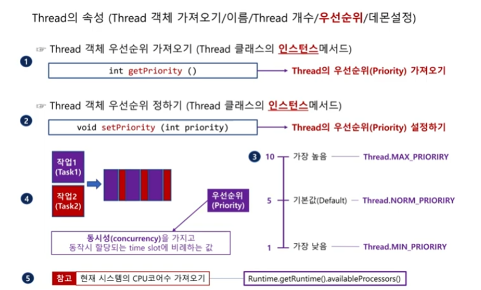
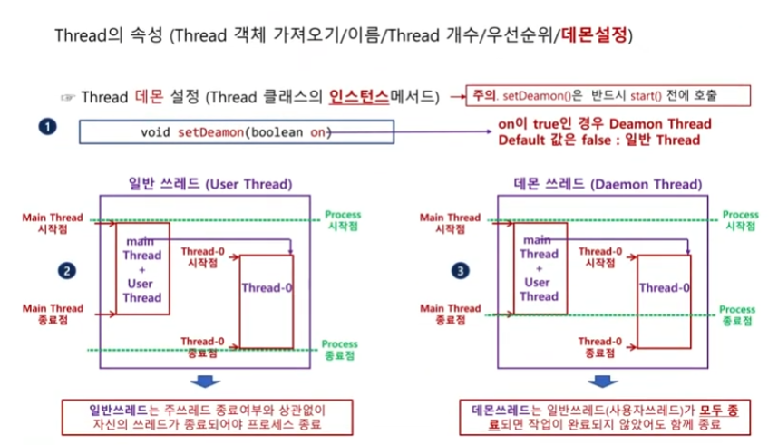
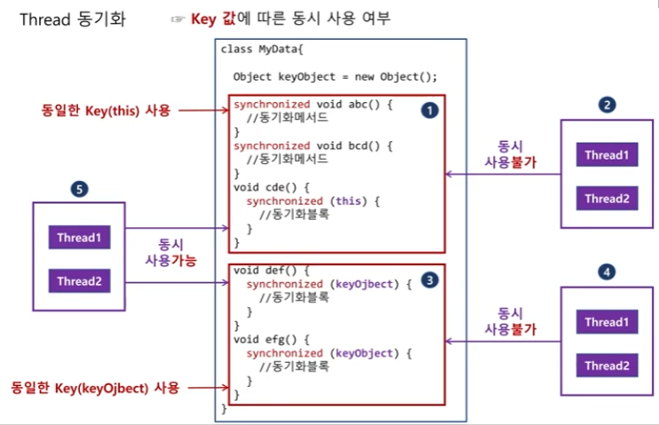
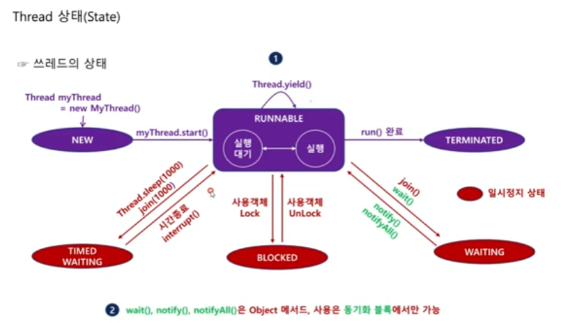
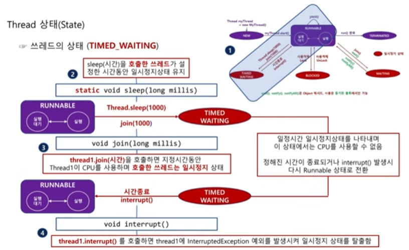
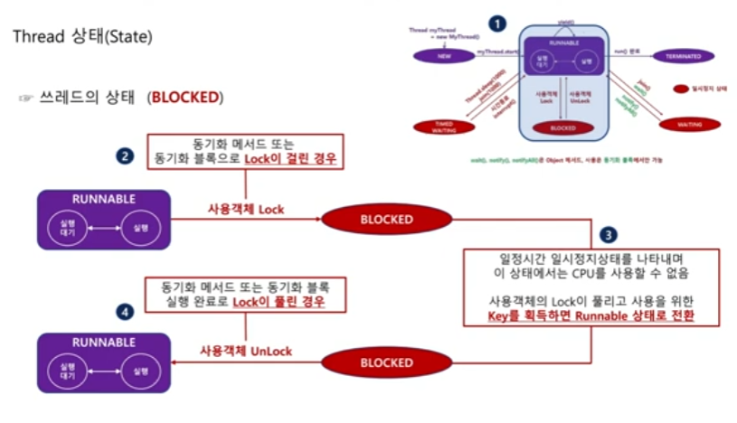
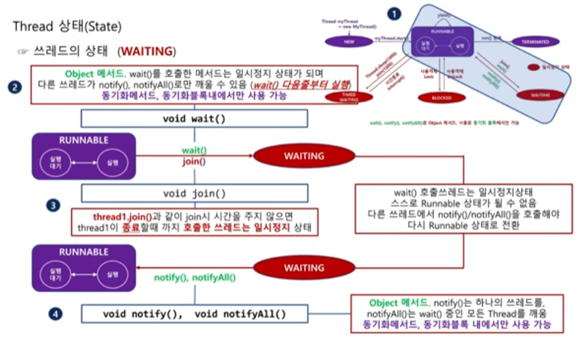

# 스레드_2

## 스레드의 속성
생성한 스레드의 객체를 참조하거나 우선순위를 지정하는 것과 같은 스레드의 속성 종류와 이를 활용하는 방법을 알아보겠습니다.

### 현재 스레드 객체 참좃값 얻어오기
Thread 클래스를 직접 정의하고 객체를 생성해 사용할 때 참조 변수를 이용해 언제든지 스레드 객체의 속성(이름 등)을 가져올 수 있습니다.
하지만, 직접 스레드 객체를 생성했을 때가 아니거나(자바의 스레드 풀 또는 main 스레드 등) 객체를 생성할 때 참조 변수를 정의하지 않을 경우에는 (new Thread().start()) 객체를 참조할 수 없게 됩니다.
이처럼 스레드 객체를 참조할 수 없을 때 Thread 클래스의 정적 메서드인 currentThread() 메서드를 이용해 현재 스레드 객체의 참조값을 얻어올 수 있습니다.

```java
// 현재 스레드 객체 참조값 얻어오기
static Thread Thread.currentThread()
```

> 스레드 풀(thread-pool)은 멀티 스레드 작업을 하기 위해 자바가 미리 생성해 놓은 스레드의 모음입니다.


### 실행 중인 스레드의 개수 가져오기
여러 개의 스레드가 실행되고 있을 때 현재 실행(active)중인 스레드의 개수를 알고자 한다면, Thread 클래스 내의 정적 메서드인 activeCount()를 사용해야 합니다.

```java
// 실행 중인 스레드의 개수 가져오기
static int Thread.activeCount()
```

activeCount()는 동일한 스레드 그룹 내에서 실행 중인 스레드의 개수를 리턴합니다.
하나의 스레드에서 별도의 지정 없이 새로운 스레드를 생성하면 생성된 스레드는 생성한 스레드와 동일한 스레드 그룹에 위치합니다.
여기서 프로그램 실행 시 최초로 생성되는 main 스레드는 main 스레드 그룹에 속하며, main 스레드에서 생성한 스레드는 모두 같은 main 스레드 그룹에 속한다는 정도만 알아두겠습니다.

### 스레드의 이름 지정 및 가져오기
여러 개의 스레드를 생성하고 실행하다 보면 각가의 스레드를 구분할 필요가 생깁니다.
스레드를 구분하는 가장 손쉬운 방법은 스레드마다 이름을 부여하는 것입니다.
직접 이름을 부여하려면 Thread 클래스의 인스턴스 메서드인 setName() 메서드를 사용해야 합니다.

```java
// 스레드 이름 설정하기
String setName(String name)
```

스레드의 이름을 직접 지정하지 않으면 컴파일러가 대신해서 자동으로 부여합니다. 이때 자동으로 부여되는 이름은 Thread-0, Thread-1, ..., Thread-N 처럼 `Thread-숫자`의 형태로 새롭게 생성될 때마다 숫자가 늘어납니다.

setName() 메서드는 인스턴스 메서드이므로 일단 스레드 객체를 생성한 후에 적용할 수 있을 것이며, 직접 지정했거나 자동으로 부여된 스레드의 이름을 가져올 때는 인스턴스 메서드인 getName()을 사용합니다.

```java
// 스레드 이름 가져오기
String getName()
```

```java
// 스레드 객체의 속성 다루기
package sec03_threadproperties.EX01_ThreadProperties_1;

public class ThreadProperties_1 {
    public static void main(String[] args) {

        // 객체 참조하기, 스레드 개수 가져오기
        Thread curThread = Thread.currentThread();
        System.out.println("현재 스레드의 이름 = " + curThread.getName());
        System.out.println("동작하는 스레드의 개수 = " + Thread.activeCount());

        // 스레드 이름 자동 지정
        for (int i = 0; i < 3; i++) {
            Thread thread = new Thread();
            System.out.println(thread.getName());
            thread.start();
        }

        // 스레드 이름 직접 지정
        for (int i = 0; i < 3; i++) {
            Thread thread = new Thread();
            thread.setName(i + "번째 스레드");
            System.out.println(thread.getName());
            thread.start();
        }

        // 스레드 이름 자동 지정
        for (int i = 0; i < 3; i++) {
            Thread thread = new Thread();
            System.out.println(thread.getName());
            thread.start();
        }

        // 스레드의 개수 가져오기
        System.out.println("동작하는 스레드의 개수 = " + Thread.activeCount());
    }
}
```

output
```
현재 스레드의 이름 = main
동작하는 스레드의 개수 = 1
Thread-0
Thread-1
Thread-2
0번째 스레드
1번째 스레드
2번째 스레드
Thread-6
Thread-7
Thread-8
동작하는 스레드의 개수 = 5
```


### 스레드의 우선순위
모든 스레드는 1 ~ 10 사이의 우선순위를 갖고 있습니다. 1이 가장 낮은 순위 값, 10이 가장 높은 순위값입니다. 우선순위를 지정하지 않으면 기본값으로 5의 우선순위를 갖습니다.

다음은 실제 자바 API에서 제공하는 Thread 클래스에 정의된 정적 상수입니다. 대표적으로 수선순위가 1, 5, 10일 때는 각가 정적 상수 Thread.MIN_PRIORITY, Thread.NORM_PRIORITY, Thread.MAX_PRIORITY 값으로 정의되어 있습니다.

```java
// The minimum priority that a thread can have.
public final static int MIN_PRIORITY = 1;
// The default priority that is assigned to a thread.
public final static int NORM_PRIORITY = 5;
// The maximum priority that a thread can have.
public final static int MAX_PRIORITY = 10;
```

이 우선순위는 스레드의 동시성과 관계가 있습니다. 만일 2개의 스레드가 2개의 CPU 코어에 각각 할당되어 동작하는 스레드 병렬성일 때 우선순위는 의미가 없습니다.
2개의 작업이 하나의 CPU코어에서 동작할 때 스레드의 동시성에 따라 2개의 작업은 일정 시간 간격으로 번갈아 가면서 실행됩니다.
이때 우선순위가 높으면 상대적으로 더 많은 시간을 할당받게 됩니다.



만일 동일한 작업량을 가진다면 우선순위가 높은 스레드가 먼저 끝날 것입니다.
스레드의 우선순위를 지정하거나 지정된 우선순위 값을 가져오는 메서드는 Thread 클래스의 인스턴스 메서드인 setPriority()와 getPriority()가 있습니다.

```java
// 스레드 객체의 우선순위 정하기
void setPriority()

// 스레드 객체의 우선순위 가져오기
int getPriority()
```

현재 컴퓨터의 CPU 코어 수를 알고 싶을 때는 다음 메서드를 사용해야 합니다.
`public native int availableProcessors()`

> 사용하는 CPU가 하이퍼 스레드를 사용할 때 실제 코어 수의 2배를 리턴합니다.
하이퍼 스레드는 각 코어에서 둘 이상의 스레드를 실행할 수 있는 하드웨어 기술로, 실제 코어 수가 4개이고, 하이퍼 스레드를 사용할 때 availableProcessors() 메서드는 8을 리턴합니다.


다음 예제에서는 10억 번의 for 문을 반복한 후 자신의 이름과 우선순위를 출력하는 MyThread 클래스를 정의했습니다.

```java
// 스레드의 우선순위
package sec03_threadproperties.EX02_ThreadProperties_2;

class MyThread extends Thread {
    @Override
    public void run() {
        for (long 1 = 0; i < 1000000000; i++) {  // 시간 지연용
            System.out.println(getName() + " 우선순위: " + getPriority())
        }
    }
}

public class ThreadProperties_2 {
    public static void main(String[] args) {

        // CPU 코어 수
        System.out.println("코어 수: " + Runtime.getRuntime().availableProcessors());

        // 우선순위 자동 지정
        for (int i = 0; i < 3; i++) {
            Thread thread = new MyThread();
            thread.start();
        }

        try {Thread.sleep(1000);} catch (InterruptedException e) {}

        // 우선순위 직접 지정
        for (int i = 0; i < 3; i++) {
            Thread thread = new MyThread();
            thread.setNAme(i + "번째 스레드");
            if (i == 9) thread.setPriority(10);
            thread.start();
        }
    }
}
```

결과를 살펴보면 마지막 스레드의 경우 가장 높은 우선순위를 가지도록 설정했습니다.
다만 주의해야 할 점은 스레드는 실제로 실행되기 전에 일정 시간의 준비 과정(메모리의 할당 등)이 필요하다는 것을 인지해서 지연시간을 늘리는 것을 고려해야 합니다.


### 스레드의 데몬 설정
일반적으로 스레드 객체를 실행하면 다른 스레드의 종료 여부와 관계없이 자신의 스레드가 종료될 때까지 계속 실행됩니다.
따라서 만일 실행된 스레드가 무한 반복 스레드라면 해당 프로세스는 영원히 종료되지 않을 것입니다.

하지만 해당 스레드를 생성해 실행한 주 스레드를 포함해 다른 스레드가 종료되면 남아 있는 작업이 있다 하더라도 종료해야 할 때가 있습니다.
예를 들면 문서 편집 프로그램에 일정 시간 간격으로 자동 저장을 수행하는 스레드가 수행되고 있을 때 문서 편집 프로그램 자체가 종료되면 자동 저장 스레드는 더이상 동작할 필요가 없을 것입니다.
이렇게 다른 스레드, 정확히는 일반 스레드가 모두 종료되면 함께 종료되는 스레드를 `데몬 스레드(daemon thread)`라고 합니다.

> 여기서는 데몬 스레드가 아닌 스레드(non-daemon thread)를 편의상 `일반 스레드`라고 부르겠습니다.



스레드의 데몬 설정은 Thread 클래스의 인스턴스 메서드인 setDaemon() 메서드를 사용하며, 기본값은 false입니다.

```java
// 데몬 스레드 설정
void setDaemon(boolean on)
```

생성한 객체의 데몬 설정 여부는 Thread 클래스의 인스턴스 메서드인 isDaemon() 메서드를 이용해 언제든지 확인할 수 있습니다.

```java
// 데몬 스레드 설정 확인
boolean isDaemon()
```

이때 주의해야 할 점은 데몬 설정은 반드시 스레드를 실행하기 전, 즉 start() 메서드 호출 전에 설정해야 한다는 것입니다.
일단 스레드가 실행되고 나면 데몬 설정은 바꿀 수 없습니다.

다음은 3.5초 동안 지속되는 main 스레드 내에서 5초 동안 지속하는 MyThread 객체를 생성 및 실행한 예입니다.
여기서 MyThread는 일반 스레드로 정의했습니다.
결과를 살펴보면 프로그램이 시작된 지 3.5초 후 main 스레드가 종료되어도 MyThread는 자신의 실행이 끝날 때까지 계속 지속되는 것을 알 수 있습니다.

```java
package sec03_threadproperties.EX03_ThreadProperties_3_1;

class MyThread extends Thread {
    @Overried
    public void run() {
        System.out.println(getName() + ": " + (isDaemon()? "데몬 스레드":"일반 스레드"));
        for (int i = 0; i < 6; i++) {
            System.out.println(getName() + ": " + i + "초");
            try {Thread.sleep(1000);} catch (InterruptedException e) {}
        }
    }
}

public class ThreadProperties_3_1 {
    public static void main(String[] args) {

        // 일반 스레드
        Thread thread1 = new MyThread();
        thread1.setDaemon(false);
        thread1.setName("thread1");
        thread1.start();

        // 3.5초 후 main 스레드 종료
        try {Thread.sleep(3500);} catch (InterruptedException e) {}
        System.out.println("main Thread 종료");
    }
}
```

output
```
thread1: 일반 스레드
thread1: 0초
thread1: 1초
thread1: 2초
thread1: 3초
main Thread 종료
thread1: 4초
thread1: 5초
```

다음은 위의 예제와 동일한 조건으로 생선 한 MyThread 객체를 실행하기 전에 setDaemon(ture)로 설정해 데몬 스레드로 정의한 것만 다릅니다.
실행 결과를 살펴보면 MyThread가 아직 실행할 내용이 남아 있는데도 main스레드가 종료되면 함께 종료됩니다.

```java
package sec03_threadproperties.EX04_ThreadProperties_3_2;

class MyThread extends Thread {
    @Override
    public void run() {
        System.out.println(getName() + ": " +(isDaemin()? "데몬 스레드":"일반 스레드"));
        for (int i = 0; i < 6; i++) {
            System.out.println(getName() + ": " + i + "초");
            try {Thread.sleep(1000);} catch (InterruptedException e) {}
        }
    }
}

public class ThreadProperties_3_2 {
    public static void main(String[] args) {

        // 데몬 스레드
        Thread thread2 = new MyThread();
        thread2.setDaemon(true);
        thread2.setName("thread2");
        thread2.start();

        // 3.5초 후 main 스레드 종료
        try {Thread.sleep(3500);} catch (InterruptedException e) {}
        System.out.println("main Thread 종료");
    }
}
```

output
```
thread2: 데몬 스레드
thread2: 0초
thread2: 1초
thread2: 2초
thread2: 3초
main thread 종료
```

다음 예제는 주의를 기울여 살펴볼 필요가 있습니다.
main 스레드에서는 MyThread 객체를 2개 생성해 실행했습니다.
이때 첫 번째는 일반 스레드, 두 번째는 데몬 스레드로 지정했습니다.
즉, 이 예제의 핵심은 `두 번째 데몬 스레드가 자신을 실행한 main 스레드가 종료되는 3.5초 시점에 종료될 것인가?`하는 것입니다.

```java
package sec03_threadproperties.EX05_ThreadProperties_3_3;

class MyThread extends Thread {
    @Override
    public void run() {
        System.out.println(getName() + ": " + (isDaemon()? "데몬 스레드":"일반 스레드"));
        for (int i = 0; i < 6; i++) {
            System.out.println(getName() + ": " + i + "초");
            try {Thread.sleep(1000);} catch (InterruptedException e) {}
        }
    }
}

public class ThreadProperties_3_3 {
    public static void main(String[] args) {

        // 일반 스레드
        Thread thread1 = new MyThread();
        thread1.setDaemon(false);
        thread1.setName("thread1");
        thread1.start();

        // 데몬 스레드
        Thread thread2 = new MyThread();
        thread2.setDaemon(true);
        thread2.setName("thread2");
        thread2.start();

        // 3.5초 후 main 스레드 종료
        try {Thread.sleep(3500);} catch (InterruptedException e) {}
        Ststem.out.println("main Thread 종료");
    }
}
```

결과를 살펴보면 두 번째 스레드(thread2)는 데몬 스레드인데도 main스레드가 끝난 이후에도 계속 지속된다는 것을 알 수 있습니다.
대부분 데몬 스레드는 자신을 호출한 주 스레드가 종료되면 함께 종료된다고 이해할 때가 많습니다.
하지만 데몬 스레드는 주 스레드가 아니라 프로세스 내의 모든 일반 스레드가 종료되어야지만 종료되는 것을 기억해야 합니다.

## 스레드의 동기화

### 동기화의 개념
`동기화(synchronized)`는 여러 가지로 설명될 수 있지만, 개념적으로 가장 쉽게 표현하면 하나의 작업이 완전히 완료된 후 다른 작업을 수행하는 것을 말합니다.

이와 반대로 `비동기(asynchronous)`는 하나의 작업 명령 이후 완료 여부와 상관없이 바로 다른 작업 명령을 수행하는 것을 말합니다.

### 동기화의 필요성
이해하기 쉽게 관련 코드를 먼저 공유하자면 먼저 MyData 클래스에는 data 필드와 plusData() 메서드가 있습니다.
plusData() 메서드는 data 필드를 가져와 2초 후에 값을 1만큼 증가시킵니다.

> 여기서 2초의 기다림은 CPU 연산 시간을 극대화해 연출하기 위한 것입니다.

PlusThread 스레드는 생성자의 매개변수로 MyData 객체를 입력받아 객체 내부의 plusData() 메서드를 호출함으로써 자신의 이름과 MyData 객체의 data 필드값을 출력합니다.
그리고 main() 메서드에서 2개의 PlusThread 객체를 생성하고, 각각의 이름을 지정한 후 1초 간격으로 실행하겠습니다.

```java
package sec04_synchronized.EX01_TheNeedsForSynchronized;

// 공유 객체
class MyData {
    int data = 3;

    public void plusData() {
        int mydata = data;  // 데이터 가져오기
        try {Thread.sleep(2000);} catch (InterruptedException e) {}
        data = mydata + 1;
    }
}

// 공유 객체를 사용하는 스레드
class PlusThread extends Thread {
    MyData myData;
    public PlusThread(MyData myData) {
        this.myData = myData;
    }
    @Override
    public void run() {
        myData.plusData();
        System.out.println(getName() + "실행 결과: " + myData.data);
    }
}

public class TheNeedsForSynchronized {
    public static void main(String[] args) {
        // 공유 객체 생성
        MyDaya myDaya = new MyData();

        // plusThread 1
        Thread plusThread1 = new PlusThread(myData);
        plusThread1.setName("plusThread1");
        plusThread1.start();

        try {Thread.sleep(2000);} catch (InterruptedException e) {}  // 1초 기다림

        // plusThread 2
        Thread plusThread2 = new PlusThread(myData);
        plusThread2.setName("plusThread2");
        plusThread2.start();
    }
}
```

output
```
plusThread1 실행 결과: 4
plusThread2 실행 결과: 4
```

객체 내부의 data 필드에 3의 값을 저장하고 있는 MyData 객체가 1개 있습니다.
이 객체를 동일한 작업을 수행하는 2개의 PlusThread 스레드가 공유하고 있고, 스레드가 동시에 MyData 객체 내의 데이터값을 1씩 증가시키고자 할 때, 당연히 data 필드값을 5가 되어야 하겠지만, 결과는 그렇지 않습니다.

이유는 두 번째 스레드가 data 필드를 증가시키는 시점에 아직 첫 번째 스레드의 실행이 끝나지 않았기 때문입니다.
(즉, 이 시점에서 data 필드값은 여전히 3입니다.)

그렇다면 처음에 예상했던 대로 스레드의 결과값이 5가 나오게 하려면 가장 쉽게 생각할 수 있는 방법은 바로 하나의 스레드가 완전히 종료된 후 다른 스레드를 실행하는 것입니다.

이렇게 한 스레드가 객체를 모두 사용해야 다음 스레드가 사용할 수 있도록 설정하는 것을 `동기화`라고 합니다.

### 동기화 방법
동기화 방법은 크게 `메서드 동기화`와 `블록 동기화`로 나눌 수 있습니다.
동기화는 `하나의 스레드가 객체를 사용한 후 다른 객체가 사용할 수 있도록 하는 설정`입니다.
다른 말로 한 객체를 두 스레드가 동시에 사용할 수 없도록 설정하는 것입니다.
즉, 하나의 스레드가 메서드 또는 블록 사용을 완전히 종료한 후 잠금이 풀리면 다른 스레드가 사용할 수 있는 것입니다.

> 여기서 하나의 스레드가 공유 객체를 사용할 때 다른 스레드가 해당 객체를 사용할 수 없도록 하는 것을 `객체를 잠근다(lock)`라고 표현합니다.
사용을 완료한 후 `객체의 잠금을 풀면(unlock)` 다른 스레드가 사용할 수 있게 됩니다.

- `메서드 동기화`: 
메서드를 동기화할 때는 동기화하고자 하는 메서드의 리턴 타입 앞에 synchronized 키워드만 넣으면 됩니다.

```java
// 메서드 동기화
접근 지정자 synchronized 리턴 타입 메서드명(입력매개변수) {
    // 동기화가 필요한 코드
}

// 예
class MyData {
    int data = 3;
    public synchronized void plusData() {
        // data 필드의 값을 + 1 수행
    }
}
```

이렇게 되면 동시에 2개의 스레드에서 해당 메서드를 실행할 수 없게 됩니다.

앞의 예제에서 MyData 객체 내의 data 필드를 1 증가시키는 메서드인 plusData() 메서드를 동기화시키면 하나의 스레드가 + 1 연산을 완전히 종료한 후에만 다른 스레드가 이 메서드를 실행시킬 수 있기 때문에 결과값이 4가 나오는 문제를 해결할 수 있게 됩니다.

```java
package sec04_synchronized.EX02_SynchronizedMethod;

// 공유 객체
class MyData {
    int data = 3;

    public synchronized void plusData() {
        int mydata = data;  // 데이터 가져오기
        try {Thread.sleep(2000);} catch (InterruptedException e) {}
        data = mydata + 1;
    }
}

// 공유 객체를 사용하는 스레드
class PlusThread extends Thread {
    MyData myData;
    public PlusThread(MyData myData) {
        this.myData = myData;
    }
    @Override
    public void run() {
        myData.plusData();
        System.out.println(getName() + "실행 결과: " + myData.data);
    }
}

public class SynchronizedMethod {
    public static void main(String[] args) {
        // 공유 객체 생성
        MyDaya myDaya = new MyData();

        // plusThread 1
        Thread plusThread1 = new PlusThread(myData);
        plusThread1.setName("plusThread1");
        plusThread1.start();

        try {Thread.sleep(2000);} catch (InterruptedException e) {}  // 1초 기다림

        // plusThread 2
        Thread plusThread2 = new PlusThread(myData);
        plusThread2.setName("plusThread2");
        plusThread2.start();
    }
}
```

output
```
plusThread1 실행 결과: 4
plusThread2 실행 결과: 5
```

- `블록 동기화`: 
멀티 스레드를 사용하는 프로그램이라 하더라도 동기화 영역에서는 하나의 스레드만 실행할 수 있기 때문에 성능 면에서는 많은 손해를 보게 됩니다.
따라서 동기화 영역은 꼭 필요한 부분에 한정해 적용하는 것이 좋습니다.
만일 메서드 전체 중에 동기화가 필요한 부분이 일부라면 굳이 전체 메서드를 동기화할 필요 없이 해당 부분만 동기화할 수 있는데, 이것이 바로 `블록 동기화`입니다.

```java
// 블록 동기화 문법 구조
synchronized (*임의의 객체) {
    // 동기화가 필요한 코드
}
// *임의의 객체: Key를 가진 객체(모든 객체는 저마다의 Key 하나를 가지고 있음) 일반적으로 클래스 내부에서 바로 사용할 수 있는 객체인 this를 사용

// 예
class MyData {
    int data = 3;
    public void plusData() {
        synchronized (this) {
            // data 필드의 값을 + 1 수행
        }
    }
}
```

여기서 임의의 객체는 말 그대로 어떤 객체도 올 수 있지만, 일반적으로 this를 넣어 자기 객체를 가리킵니다.
this는 모든 클래스 내부에서 객체의 생성 과정 없이 바로 사용할 수 있기 때문입니다.
블록 동기화를 사용해 앞의 예제를 수정하면 메서드 내의 모든 내용을 블록 동기화했으므로 메서드 동기화 예제와 성능상의 차이는 없지만, 메서드 내의 코드가 길고, 연산 과정이 다수 포함되어 있다면 메서드 전체를 동기화하는 것과 일부 코드만을 동기화하는 것 사이에는 성능상의 차이가 존재합니다.

```java
package sec04_synchronized.EX03_SynchronizedBlock;

// 공유 객체
class MyData {
    int data = 3;
    public void plusData() {
        synchronized (this) {
            int mydata = data;  // 데이터 가져오기
            try {Thread.sleep(2000);} catch (InterruptedException e) {}
            data = mydata + 1;
        }
    }
}

// 공유 객체를 사용하는 스레드
class PlusThread extends Thread {
    MyData myData;
    public PlusThread(MyData myData) {
        this.myData = myData;
    }
    @Override
    public void run() {
        myData.plusData();
        System.out.println(getName() + "실행 결과: " + myDtaa.data);
    }
}

public class SynchronizedBlock {
    public static void main(String[] args) {
        // 공유 객체 생성
        MyData myData = new MyData();

        // plusThread 1
        Thread plusThread1 = new PlusThread(myData);
        plusThread1.getName("plusThread1");
        plusThread1.start();

        try {Thread.sleep(1000);} catch (InterruptedException e) {}

        // plusThread 2
        Thread plusThread2 = new PlusThread(myData);
        plusThread2.getName("plusThread2");
        plusThread2.start();
    }
}
```

output
```
plusThread1 실행 결과: 4
plusThread2 실행 결과: 5
```

### 동기화의 원리
모든 객체는 자신만의 열쇠(Key)를 하나씩 가지고 있습니다.
예를 들어 블록 동기화 코드(Synchronized(this){...})일 때 블록이 this 객체가 가지고 있는 열쇠로 잠깁니다.
첫 번째로 동기화 블록을 실행하는 스레드가 그 열쇠를 가지게 되며, 그 스레드가 동기화 블록의 실행을 완료하기 전까지 다른 스레드는 열쇠를 얻을 수 없으므로 그 블록을 실행할 수 없는 것입니다.

블록 동기화의 소괄호 안에는 어떤 객체가 와도 무방합니다.
어차피 열쇠는 모든 객체가 가지고 있기 때문입니다.
다만, 메서드를 동기화하는 경우에는 this 객체의 열쇠만을 사용합니다.
따라서 하나의 객체 내부에 3개의 동기화 메서드가 있다면 이 메서드 모두가 this의 열쇠로 잠겨있기 때문에 1개의 스레드가 이들 중 1개의 메서드를 실행하고 있다면 나머지 2개의 메서드도 함께 잠겨 사용할 수 없게 됩니다.

이해를 돕기 위해 다음 예제를 살펴보면, MyData의 내부에는 5개의 메서드가 있고, 이중 2개의 메서드 동기화, 나머지 3개는 블록 동기화되어 있습니다.

블록 동기화 중 1개는 this 객체의 열쇠를 사용해 동기화되어 있고, 나머지 2개는 KeyObject 객체의 열쇠로 동기화되어 있습니다.
여기서 KeyObject 타입의 KeyObject 객체는 오직 열쇠의 역할을 하기 위해 생성한 객체입니다.



이들 메서드를 2개의 스레드(Thread1, Thread2)가 동시에 사용하고자 할 때를 고려해 보면, 먼저 abc(), bcd(), cde()는 모두 this 객체의 열쇠를 사용하기 때문에 이들 중 1개의 메서드가 실행되는 도중에는 다른 어떤 메서드도 동시에 실행할 수 없습니다.

반면 def(), efg() 메서드는 앞의 3개 메서드와 다른 열쇠를 사용하기 때문에 2개의 스레드가 각각 동시에 실행할 수 있지만, def()와 efg()도 동일한 열쇠를 사용하기 때문에 두 메서드를 동시에 실행할 수 없습니다.

```java
package sec04_synchronized.EX04_KeyObject_1;

class MyData {
    synchronized void abc() {
        for (int i = 0; i < 3; i++) {
            System.out.println(i + "sec");
            try {Thread.sleep(1000);} catch (InterruptedException e) {}
        }
    }

    synchronized void bcd() {
        for (int i = 0; i < 3; i++) {
            System.out.println(i + "초");
            try {Thread.sleep(1000);} catch (InterruptedException e) {}
        }
    }

    void cde() {
        synchronized(this) {
            for (int i = 0; i < 3; i++) {
                System.out.println(i + "번째");
                try {Thread.sleep(1000);} catch (InterruptedException e) {}
            }
        }
    }
}

public class KeyObject_1 {
    public static void main(String[] args) {
        // 공유 객체
        MyData myData = new MyData();
        // 3개의 스레드가 각각의 메서드 호출
        new Thread() {
            public void run() {
                myData.abc();
            };
        }.start();
        new Thread() {
            public void run() {
                myData.bcd();
            };
        }.start();
    }
}
```

output
```
0sec
1sec
2sec
0번째
1번째
2번째
0초
1초
2초
```

- 어떤 열쇠를 사용하느냐에 따라 동시 사용 여부가 정해지는 개념만 잘 파악해서 이해하면 좋습니다.

```java
package sec04_synchronized.EX05_KeyObject_2;

class MyData {
    synchronized void abc() {
        for (int i = 0; i < 3; i++) {
            System.out.println(i + "sec");
            try {Thread.sleep(1000);} catch (InterruptedException e) {}
        }
    }
    synchronized void bcd() {
        for (int i = 0; i < 3; i++) {
            System.out.println(i + "초");
            try {Thread.sleep(1000);} catch (InterruptedException e) {}
        }
    }
    void cde() {
        synchronized(new Object()) {
            for (int i = 0; i < 3; i++) {
                System.out.println(i + "번째");
                try {Thread.sleep(1000);} catch (InterruptedException e) {}
            }
        }
    }
}

public class KeyObject_2 {
    public static void main(String[] args) {
        // 공유 객체
        MyData myData = new MyData();
        // 3개의 스레드가 각각의 메서드 호출
        new Thread() {
            public void run() {
                myData.abc();
            };
        }.start();
        new Thread() {
            public void run() {
                myData.bcd();
            };
        }.start();
        new Thread() {
            public void run() {
                myData.cde();
            };
        }.start();
    }
}
```

output
```
0sec
0번째
1sec
1번째
2sec
2번째
0초
1초
2초
```

## 스레드의 상태
스레드는 객체가 생성, 실행, 종료되기까지 다양한 상태를 가집니다.
각 스레드의 상태는 Thread.state 타입으로 정의되어 있으며, Thread의 인스턴스 메서드인 getState()로 가져올 수 있습니다.
이 메서드는 스레드의 상태를 Thread.State 타입에 저장된 문자열 상수값 중 하나로 반환합니다.

```java
// 스레드의 상태 값 가져오기
Thread.state getState()
```

Thread.State는 enum 타입인데, 간단히 상수들의 집합을 표현하기 위한 문법 체계로 문자열 상수들을 모아놓은 자료형 정도로 이해하면 됩니다.

Thread.State의 내부에는 6개의 문자열 상수(NEW, RUNNABLE, TERMINATED, TIMED_WAITING, BLOCKED, WAITING)가 저장되어 있습니다.

스레드의 상태에 따라 특정 작업을 수행해야 할 때는 일반적으로 다음 예와 같이 switch 선택 제어문을 이용해 작성합니다.

```java
// 스레드의 상태에 따른 동작 수행
Thread.State state = myThread.getState();
switch (state) {
    case Thread.State.NEW:
        // ...
    case Thread.State.RUNNABLE:
        // ...
    case Thread.State.TERMINATED:
        // ...
    case Thread.State.TIMED_WAITING:
        // ...
    case Thread.State.BLOCKED:
        // ...
    case Thread.State.WAITING:
        // ...
}
```

### 스레드의 6가지 상태



- NEW, TUNNABLE, TERMINATED
처음 객체가 생성되면 NEW의 상태를 가지며, 이후 start() 메서드로 실행하면 RUNNABLE 상태가 됩니다.
이 상태에서는 실행과 실행 대기를 반복하면서 CPU를 다른 스레드들과 나눠 사용합니다.
이후 run() 메서드가 종료되면 TERMINATED 상태가 됩니다.
RUNNABLE 상태에서는 상황에 따라 TIMED_WAITING, BLOCKED, WAITING라는 일시정지 상태로 전환될 수 있습니다.

- TIMED_WAITING
먼저 정적 메서드인 Thread.sleep(long millis) 또는 인스턴스 메서드인 join(long millis)가 호출되면 스레드는 TIMED_WAITING 상태가 됩니다.

```java
// RUNNABLE -> TIMED_WAITING 상태로 전환하기 1
static void Thread.sleep(long millis)

// RUNNABLE -> TIMED_WAITING 상태로 전환하기 2
synchronized void join(long millis)
```

말 그대로 일정 시간 동안 일시정지되는 겁니다.
만일 설정한 일시정지 시간이 지나거나 중간에 interrupt() 메서드가 호출되면 다시 RUNNABLE 상태가 됩니다.

```java
// TIMDE_WAITING -> RUNNABLE 상태로 전환하기 1
일시정지 시간 종료
// TIMED_WAITING -> RUNNABLE 상태로 전환하기 2
void interrupt()
```

여기서 한 가지 짚고 넘어가야 할 것이, Thread.sleep(long millis) 메서드와 join(long millis) 메서드의 호출로 일시정지되는 대상은 이들 메서드를 호출한 스레드라는 점에서는 동일합니다.
여기서 차이점은 예를 들어 스레드 A에서 Thread.sleep(1000)을 실행했다면, 스레드 A는 외부에서 interrupt() 메서드가 호출되지 않는 한 1초 동안 일시정지 상태가 유지됩니다. 하지만, `스레드 B 객체.join(1000)`과 같이 호출하면 이는 `나는 일시정지할 테니 스레드 B에게 CPU를 할당해줘`는 의미를 갖습니다.
따라서 만일 스레드 B가 0.5초만에 실행이 완료된다면 외부 interrupt() 메서드의 호출 없이도 다시 스레드 A는 RUNNABLE 상태가 됩니다.

- BLOCKED
두 번째 일시정지 상태는 BLOCKED 상태로 바로 이전에 살펴본 동기화 메서드 또는 동기화 블록을 실행하기 위해 먼저 실행 중인 스레드의 실행 완료를 기다리는 상태입니다.
다른 말로 이야기 하면 먼저 실행 중인 스레드가 열쇠를 반납할 때가지 문 앞에서 기다리고 있는 상태가 바로 BLOCKED입니다. 당연히 객체의 잠금이 풀리면, 즉 앞의 스레드의 동기화 영역 수행이 완료되면 BLOKED 상태의 스레드는 RUNNABLE 상태가 되어 해당 동기화 영역을 실행하게 됩니다.

- WAITING
마지막은 WAITING 상태입니다. 시간 정보가 없는 join() 메서드가 호출되거나 wait() 메서드가 호출되면 WAITING 상태가 됩니다.
wait()는 Object 클래스로부터 상속받은 메서드입니다.

```java
// RUNNABLE -> WAITING 상태로 전환하기 1
synchronized void join()
// RUNNABLE -> WAITING 상태로 전환하기 2
void wait()
```

WAITING 상태로 전환되는 과정에서 일시정지하는 시간을 정한 바가 없으므로 한없이 일시정지 상태에 빠져 있을 것입니다.
이 상태에서 다시 RUNNABLE 상태로 돌아가는 방법은 어떤 메서드를 이용해 WAITING 상태가 되었는지에 따라 다릅니다.

먼저 join() 메서드의 호출로 WAITING 상태가 됐을 때는 TIMED_WAITING일 때와 마찬가지로 join()의 대상이 된 스레드가 종료되거나 외부에서 interrupt() 메서드가 호출되면 다시 RUNNABLE 상태로 돌아갑니다.

```java
// join() 메서드로 WAITING 상태가 됐을 때 WAITING -> RUNNABLE 상태로 전환하기 1
join()의 대상 스레드가 종료
// join() 메서드로 WAITING 상태가 됐을 때 WAITING -> RUNNABLE 상태로 전환하기 1
void interrupt()
```

반면 wait() 메서드의 호출로 WAITING 상태가 됐을 때는 Object 클래스의 notify() 또는 notifyAll() 메서드를 이용해 다시 RUNNABLE 상태로 돌아갈 수 있습니다.

```java
// wati() 메서드로 WAITING 상태가 됐을 때 WAITING -> RUNNALBE 상태로 전환하기
void notify()
void notifyAll()
```

notify()는 WAITING 상태에 있는 하나의 스레드를 RUNNABLE 상태로 전환하는 메서드이며, notifyAll()은 WAITING 상태의 모든 스레드를 RUNNABLE 상태로 전환하는 메서드입니다.
여기서 주의해야 할 점은 `wtit(), notify(), notifyAll()은 동기화 블록 내에서만 사용할 수 있습니다.`

### NEW, RUNNABLE, TERMINATED
먼저 NEW 상태는 Thread 객체를 new 키워드를 이용해 생성한 시점으로 아직 start() 메서드 호출 이전 상태, 즉 실행 이전 상태입니다.
이후 start() 메서드를 호출하면 RUNNABLE 상태가 됩니다.
이후 run() 메서드가 완전히 종료되면 스레드는 TERMINATED 상태가 됩니다.

- new : new 키워드로 스레드의 객체가 생성된 상태(start() 전)
- Thread.yield() : 다른 스레드에게 CPU 사용을 양보하고 자신은 실행 대기 상태로 전환
- RUNNABLE : start() 이후 CPU를 사용할 수 있는 상태
다른 스레드들과 동시성에 따라 실행과 실행 대기를 교차함
- TERMINATED : run() 메서드의 작업 내용이 모두 완료되어 스레드가 종료된 상태
한 번 실행(start())된 스레드는 재실행이 불가능하며 객체를 새롭게 생성해야 함

다음 예제는 통해서 실행결과를 보게되면 myThread의 상태가 NEW -> RUNNABLE -> TERMINATED의 순으로 스레드의 상태가 변화하는 것을 알 수 있습니다.

```java
package sec05_threadstates.EX01_NewRunnableTerminated;

public class NewRunnableTerminated {
    public static void main(String[] args) {
        // 스레드 상태 저장 클래스
        Thread.State state;

        // 1. 객체 생성(NEW)
        Thread myThread = new Thread() {
            @Override
            public void run() {
                for (long i = 0; i < 1000000000L; i++) {} // 시간 지연
            }
        };
        state = myThread.getState();
        System.out.println("myThread state = " + state);

        // 2. myThread 시작
        myThread.start();
        state = myThread.getState();
        System.out.println("myThread state = " + state);

        // 3. myThread 종료
        try {
            myThread.join();  // myThread 실행이 완료될 때 까지 main 스레드 일시 정지
        } catch (InterruptedException e) {}
        state = myThread.getState();
        System.out.println("myThread state = " + state);
    }
}
```

output
```
myThread state = NEW
myThread state = RUNNABLE
myThread state = TERMINATED
```

RUNNABLE 상태에서는 스레드 간의 동시성에 따라 실행과 실행 대기를 반복합니다.
Thread의 정적 메서드인 yield()를 호출하면 다른 스레드에게 CPU 사용을 인위적으로 양보하고, 자신은 실행 대기 상태로 전환할 수도 있습니다.

```java
static void Thread.yield();
```

yield() 메서드로 영영 CPU 사용을 양보하는 것은 당연히 아닙니다.
자신의 차례를 딱 한 번 양보하는 메서드로, 자신의 차례가 돌아오면 다시 CPU를 사용할 수 있습니다.

다음 예제를 통해서 yieldFlag = true일 때 다른 스레드에게 자신의 차례를 양보합니다. 이와 반대로 yieldFlag = false일 때는 자신의 스레드의 이름을 출력하고 일정 시간을 지연합니다.
2개의 스레드를 각각 yieldFlag 값을 flase와 true로 초기화하고 1초에 한 번씩 값을 반전시켜, 1초마다 번갈아가며 CPU를 사용하도록 했습니다.

```java
package sec05_threadstates.EX02_YieldInRunnableState;

class MyThread extends Thread {
    boolean yieldFlag;
    @Override
    public void run() {
        while(true) {
            if (yieldFlag) {
                Thread.yield();  // yieldFlag가 true면 다른 스레드에게 CPU 사용권을 양보
            } else {
                System.out.println(getName() + " 실행");
                for (long i = 0; i < 1000000000L; i++) {}  // 시간 지연
            }
        }
    }
}

public class YieldInRunnableState {
    public static void main(String[] args) {
        MyThread thread1 = new MyThread();
        thread1.setName("thread1");
        thread1.yieldFlag = false;
        thread1.setDaemon(true);
        thread1.start();

        MyThread thread2 = new MyThread();
        thread2.setName("thread2");
        thread2.yieldFlag = true;
        thread2.setDaemon(true);
        thread2.start();

        // 6초 지연(1초마다 한 번씩 양보)
        for (int i = 0; i < 6; i++) {
            try {Thread.sleep(1000);} catch (InterruptedException e) {}
            thread1.yieldFlag = !thread1.yieldFlag;
            thread2.yieldFlag = !thread2.yieldFlag;
        }
    }
}
```

RUNNABLE 상태가 끝나면, 즉 스레드 내부의 run() 메서드의 실행이 완료되면 스레드는 TERMINATED 상태가 됩니다.
말 그대로 스레드의 실행이 완전히 종료됐다는 것을 의미합니다.
앞에서도 언급했듯이 스레드의 실행이 완전히 종료되어도 스레드의 객체는 남아 있지만, 다시 스레드를 실행할 수는 없습니다.
만일 스레드를 실행하고 싶다면 새로운 객체를 만들어야 합니다

> 실행이 끝난 스레드 객체는 내부에서 정의한 필드 또는 메서드를 호출하는 용도로만 사용할 수 있습니다.

### TIMED_WAITING
이제 RUNNABLE 상태에서 일시정지 상태로 전환되는 TIMED_WAITING 상태에 대해 알아보겠습니다.
RUNNABLE 상태에서 TIMED_WAITING 상태가 됐을 때는 Thread의 정적 메서드인 sleep(long millis)를 호출하거나 인스턴스 메서드인 join(long millis)가 호출됐을 때입니다.
여기서 sleep(long millis)와 join(long millis)를 명확히 구분할 필요가 있습니다.
하나는 정적 메서드, 다른 하나는 인스턴스 메서드라는 점 이외에 메서드의 의미 또한 다릅니다.

Thread.sleep()은 이 메서드를 호출한 스레드를 일시정지하라는 의미이며, 호출한 스레드는 TIMED_WAITING 상태가 됩니다.
이때 일시정지 시간 동안 CPU를 어떤 스레드가 사용하든 상관하지 않습니다.

반면 스레드 객체.join(long millis) 메서드는 특정 스레드 객체에게 일정 시간 동안 CPU를 할당하라는 의미입니다. 일반적으로 다른 스레드의 결과가 먼저 나와야 이후의 작업을 진행할 때 join(long millis)를 사용할 수 있습니다.
물론 해당 메서드를 호출한 스레드도 TIMED_WAITING 상태가 됩니다.

TIMED_WAITING 상태에서 지정된 시간이 다 되거나 일시정지된 스레드 객체의 interrupt() 메서드가 호출되면 다시 RUNNABLE 상태가 됩니다.

또한 Thread.sleep(long millis)와 join(long millis)는 모두 InterruptedException을 처리해 줘야 하는데, interrupt() 메서드가 호출되면 이 예외가 발생해 일시정지가 종료되는 것입니다.



- Thread.sleep(long millis)를 이용한 일시정지 및 RUNNABLE 상태 전환

다음 예제에서는 run() 메서드의 시작과 동시에 Thread.sleep(3000)를 실행하는, 즉 스레드 시작과 동시에 3초 동안 일시정지(TIMED_WAITING) 상태가 되는 MyThread 클래스를 정의하겠습니다.

```java
package sec05_threadstates.EX03_TimedWaiting_Sleep;

class MyThread extends Thread {
    @Override
    public void run() {
        try {
            Thread.sleep(3000);
        } catch (InterruptedException e) {
            System.out.println(" -- sleep() 진행 중 interrupt() 발생");
            for (long i = 0; i < 1000000000L; i++) {}  // 시간 지연
        }
    }
}

public class TimedWaiting_Sleep {
    public static void main(String[] args) {

        MyThread myThread = new MyThread();
        myThread.start();

        try {Thread.sleep(100);} catch (InterruptedException e) {}  // 스레드 시작 준비 시간
        // TIMED_WAITING
        myThread.interrupt();  // TIMED_WAITING -> RUNNABLE 상태 전환
        try {Thread.sleep(100);} catch (InterruptedException e) {}
        System.out.println("MyThread State = " + myThread.getState());
    }
}
```

output
```
MyThread State = TIMED_WAITING
 -- sleep() 진행 중 interrupt() 발생
MyThread State = RUNNABLE
```

위 예제에서 주의해서 살펴볼 부분은 스레드를 시작한 후 Thread.sleep(100)을 실행해 0.1초 후에 스레드의 상태를 출력했다는 점입니다.
이는 스레드를 처음 시작할 때 JVM이 CPU를 독립적으로 사용하기 위한 메모리 할 당 등의 준비 과정을 미리 거쳐야 하기 때문입니다.
이 모든 준비가 끝나야 비로소 run() 메서드가 실행됩니다.
만약 start() 메서드를 실행한 후 스레드가 아직 준비되지 않은 상태에서 바로 스레드의 상태를 출력하면 run() 메서드가 호출되지 않아 RUNNABLE 상태가 출력될 수도 있습니다.

interrupt() 메서드 호출 이후도 마찬가지 입니다.
interrupt() 메서드를 호출하면 JVM은 InterruptedException 객체를 생성해 해당 스레드의 catch() {} 블록에 전달해야 합니다.
일단 전달되면 RUNNABLE 상태가 되겠지만, 전달되기 전까지는 여전히 TIMED_WAITING 상태일 것입니다. 이것이 바로 start() 메서드와 interrupt() 메서드 사이에 0.1초의 시간 지연을 둔 이유입니다.
또한, MyThread 클래스 내부의 for 반복문이 0.1초보다 빨리 끝나면 interrupt() 메서드 호출 이후의 상태가 TIMED_WAITING로 출력될 수도 있습니다.
그러므로 for 문의 반복 횟수를 적절히 조절해야 합니다.

- join(long millis)를 이용한 일시정지 및 RUNNABLE 상태 전환

특정 스레드 객체의 join(long millis) 메서드를 호출하면 해당 스레드 객체에게 매겨변수로 넘겨 준 시간 동안 CPU 사용권을 넘겨 주고, 자신은 일시정지 상태가 됩니다.

2개의 스레드와 main 스레드로 구성되어 있는 다음 예를 살펴보겠습니다.

```java
package sec05_threadstates.EX04_TimedWaiting_Join;

class MyThread1 extends Thread {
    @Override
    public void run() {
        for (long i = 0; i < 1000000000L; i++) {}  // 시간 지연
    }
}

class MyThread2 extends Thread {
    MyThread1 myThread1;
    public MyThread(MyThread1 myThread1) {
        this.myThread1 = myThread1;
    }
    @Override
    public void run() {
        try {
            myThread1.join(3000);
        } catch (InterruptedException e) {
            System.out.println(" -- join(...) 진행 중 interrupt() 발생");
            for (long i = 0; i < 1000000000L; i++) {}  // 시간 지연
        }
    }
}

public class TimedWaiting_Join {
    public static void main(String[] args) {
        // 객체 생성
        MyThread1 myThread1 = new MyThread1();
        MyThread2 myThread2 = new MyThread2(myThread1);  // myThread1을 3초 동안 먼저 실행
        myThread1.start();
        myThread2.start();
        try {Thread.sleep(100);} catch (InterruptedException e) {}  // 스레드 시작 준비 시간
        System.out.println("MyThread1 State = " + myThread1.getState());
        System.out.println("MyThread2 State = " + myThread2.getState());
        // TIMED_WAITING
        myThread2.interrupt();  // TIMED_WAITING -> RUNNABLE 상태 전환
        try {Thread.sleep(100);} catch (InterruptedException e) {}  // 인터럽트 준비 시간
        System.out.println("MyThread1 State = " + myThread1.getState());
        System.out.println("MyThread2 State = " + myThread2.getState());
    }
}
```

output
```
MyThread1 State = RUNNABLE
MyThread2 State = TIMED_WAITING
 -- join(...) 진행 중 interrupt() 발생
 MyThread1 State = RUNNABLE
 MyThread2 State = RUNNABLE
```

### BLOCKED



BLOCKED는 동기화 메서드 또는 동기화 블록을 실행하고자 할 때 이미 다른 스레드가 해당 영역을 실행하고 있는 경우 발생합니다.
이렇게 해당 동기화 영역이 잠겨(lock)있을 때는 이미 실행하고 있는 스레드가 실행을 완료하고, 해당 동기화 영역의 열쇠를 반납할 때까지 기다려야 하는데, 이것이 BLOCKED 상태입니다.

여기서 한 가지 유의해야 할 점은, 만일 동일한 동기화된 영역을 3개의 스레드(t1, t2, t3)가 동시에 실행할 때는, 당연히 가장 먼저 도착한 t1 스레드가 동기화 영역을 실행할 것이고 t2, t3 스레드는 BLOCKED 상태가 될 것입니다.
문제는 `다음 실행은 누가 될 것인가?`인데, 이때 t2가 되는 것이 아니라 열쇠가 반납되면 다시 t2, t3는 경쟁을 통해서 실행 권한을 가지게 됩니다.

```java
package sec05_threadstates.EX05_BlockedState;

class MyBlockTest {
    // 공유 객체
    MyClass mc = new MyClass();
    // 3개의 다른 스레드 필드 생성
    Thread t1 = new Thread("thread1") {
        public void run() {
            mc.syncMethod();
        };
    };
    Thread t2 = new Thread("thread2") {
        public void run() {
            mc.syncMethod();
        };
    };
    Thread t3 = new Thread("thread3") {
        public void run() {
            mc.syncMethod();
        };
    };

    void startAll() {
        t1.start();
        t2.start();
        t3.start();
    }

    class MyClass {
        synchronized void syncMethod() {
            try {Thread.sleep(100);} catch (InterruptedException e) {}
            System.out.println("====" + Thread.currentThread().getName() + "====");
            System.out.println("thread1->" + t1.getState());
            System.out.println("thread2->" + t2.getState());
            System.out.println("thread3->" + t3.getState());
            for (long i = 0; i < 1000000000L; i++) {}  // 시간 지연
        }
    }
}

public class BlockedState {
    public static void main(String[] args) {
        MyBlockTest mbt = new MyBlockTest();
        mbt.startAll();
    }
}
```

output
```
====thread1====
thread1->RUNNABLE
thread2->BLOCKED
thread3->BLOCKED
====thread3====
thread1->TERMINATED
thread2->BLOCKED
thread3->RUNNALBE
====thread2====
thread1->TERMINATED
thread2->RUNNALBE
thread3->TERMINATED
```

### WAITING



마지막 일시정지 상태는 WAITING 상태입니다.
먼저 일시정지하는 시간의 지정 없이 스레드 객체.join() 메서드를 호출하면 조인된 스레드 객체의 실행이 완료될 때가지 이를 호출한 스레드는 WAITING 상태가 됩니다.
이때는 조인된 스레드가 완료되거나 interrupt() 메서드 호출로 예외를 인위적으로 발생시켰을 때만 다시 RUNNABLE 상태로 돌아갈 수 있습니다.

스레드의 인스턴스 메서드인 wait()를 호출할 때도 해당 스레드는 WAITING 상태가 됩니다.
정확히는 Object 클래스의 인스턴스 메서드이며, Thread 클래스도 당연히 Object 클래스의 자식 클래싱므로 이 메서드를 포함하고 있습니다.

wait() 메서드의 호출로 WAITING 상태가 됐을 때 주의해야 할 점은 2가지 입니다.
첫 번째는 일단 wait() 메서드로 WAITING 상태가 된 스레드는 다른 스레드에서 notify() 또는 notifyAll()을 호출해야만 RUNNABLE 상태가 될 수 있다는 점이며, 이는 스스로 WAITING 상태를 벗어날 수 없다는 것입니다.
스레드는 실행중에 wait() 메서드를 만나면 그자리에서 WAITING 상태가 됩니다.
이후 다른 스레드에서 notify() 또는 notifyAll() 메서드가 호출되면 일시정지됐던 지점인 wait()의 다음 줄부터 다시 이어서 실행합니다.
처음부터 다시 실행되는 것이 아니므로 wati()의 위치를 신경써서 작성해야 합니다.
그리고 두 번째는 wait(), notify(), notifyAll() 메서드는 반드시 동기화 블록에서만 사용할 수 있다는 점입니다.

다음 예제에서는 데이터 1개만을 가지고 있는 객체를 데이터를 쓰는 스레드와 읽는 스레드를 동기화 메서드로 설정했습니다.
즉, 읽고 쓰는 것은 절대 동시에 이러나지 않습니다.
하지만 결과는 엉망이 됩니다.
이유는 이전에도 언급되었듯이 WAITING 상태인 스레드가 순서대로 진행되는 것이 아닌, 경쟁을 통해서 실행되기 때문입니다.

```java
package sec05_threadstates.EX06_Waiting_WaitNotify_1;

class DataBox {
    int data;
    synchronized void inputData(int data) {
        this.data = data;
        System.out.println("입력 데이터: " + data);
    }
    synchronized void outputData() {
        System.out.println("출력 데이터: " + data);
    }
}

public class Waiting_WaitNotify_1 {
    public static void main(String[] args) {
        DataBox dataBox = new DataBox();
        Thread t1 = new Thread() {
            public void run() {
                for (int i = 0; i < 9; i++) {
                    dataBox.inputDate(i);
                }
            };
        };

        Thread t2 = new Thread() {
            public void run() {
                for (int i = 0; i < 9; i++) {
                    dataBox.outputData();
                }
            };
        };

        t1.start();
        t2.start();
    }
}
```

이을 해결하기 위해서는 쓰기 -> 읽기 -> 쓰기 -> 읽기... 와 같이 반복되어야 하며, 이때 사용하는 메서드가 바로 wait(), notify() 메서드 입니다.

다음 예제에서는 아래와 같은 순서로 실행되도록 작성해보겠습니다.

1. 쓰기 스레드 동작(데이터 쓰기)
2. 읽기 스레드 깨우기(notify())
3. 쓰기 스레드 일시정지(wait())
4. 읽기 스데르 동작(데이터 읽기)
5. 쓰기 스레드 깨우기(notify())
6. 읽기 스레드 일시정지(wait())
7. (1.) ~ (6.) 반복

```java
package sec05_threadstates.EX07_Waiting_WaitNotify_2;

class DataBox {
    boolean isEmpty = true;
    int data;
    synchronized void inputData(int data) {
        if (!isEmpty) {
            try {wait();} catch (InterruptedException e) {}  // WAITING
        }
        this.data = data;
        isEmpty = false;
        System.out.println("입력 데이터: " + data);
        notify();
    }
    synchronized void outputData() {
        if(isEmpty) {
            try {wait();} catch (InterruptedException e) {}  // WAITING
        }
        isEmpty = true;
        System.out.println("출력 데이터: " + data);
        notify();
    }
}

public class Waiting_WaitNotify_2 {
    public static void main(String[] args) {
        DataBox dataBox = new DataBox();
        Thread t1 = new Thread() {
            public void run() {
                for (int i = 0; i < 9; i++) {
                    dataBox.inputData(i);
                }
            };
        };
        Thread t2 = new Thread() {
            public void run() {
                for (int i = 0; i < 9; i++) {
                    dataBox.outputData();
                }
            };
        };
        t1.start();
        t2.start();
    }
}
```

