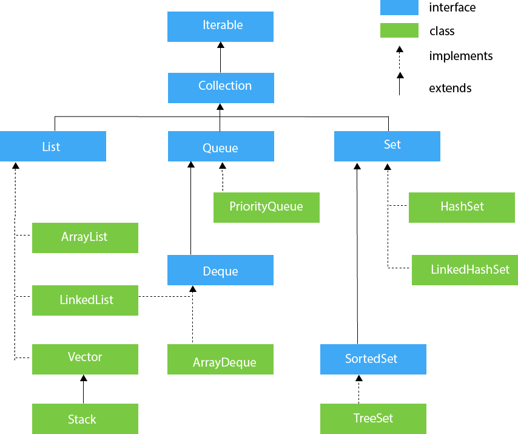

# 컬렉션 프레임워크_01
컬렉션은 이름에서 유추할 수 있듯이 `여러 데이터를 수집해 놓은 자료구조 입니다.`
컬렉션의 가장 큰 특징은 데이터 저장 공간의 크기가 동적으로 변한다는 것이고, 따라서 데이터의 개수가 시간으적으로 별할 때는 컬력션 프레임워크가 유용합니다.

## 컬렉션 프레임워크의 개념과 구조

### 컬렉션이란?
`컬렉션(collection)`은 동일한 타입을 묶어 관리하는 자료구조를 말합니다.
배열도 동일한 타입을 묶어 관리하지만 배열과 컬렉션은 다릅니다.

컬렉션과 배열이 구분되는 가장 큰 특징으로는 바로 데이터의 `저장 용량(capacity)`을 동적으로 관리 할 수 있는지의 여부의 차이점입니다.

### 컬렉션 프레임워크란?
먼저 `프레임워크(framework)`란 일반적으로 단순히 연관된 클래스와 인터페이스들의 묶음을 `라이브러리(library)`라고 하고, 클래스 또는 인터페이스를 생성하는 과정에서 설계의 원칙 또는 구조에 따라 클래스 또는 인터페이스를 설계하고, 이렇게 설계된 클래스와 인터페이스를 묶어 놓은 개념입니다.

컬렉션 프레임워크는 이러한 컬렉션과 프레임워크가 조합된 개념으로 리스트, 스택, 큐, 트리 등의 자료구조에 정렬, 탐색 등의 알고리즘을 구조화해 놓은 프레임워크입니다.

쉽게 말하자면 여러 개의 데이터 묶음 자료를 효과적으로 처리하기 위해 구조화된 클래스 또는 인터페이스의 모음입니다.

자바에서 제공하는 컬렉션 프레임워크의 주요 클래스와 인터페이스는 아래와 같습니다.

[출처:https://www.javatpoint.com/collections-in-java]

컬렉션 특성에 따라 구분하면 크게 `List<E>`, `Set<E>`, `Map<K, V>`로 나눌 수 있고, 메모리의 입출력 특성에 따라 기존의 컬렉션 기능을 확장 또는 조합한 `Stack<E>`, `Queue<E>`가 있습니다.

## `List<E>` 컬렉션 인터페이스
`List<E>`는 배열과 가장 비슷한 구조를 지니고 있는 자료구조입니다.

### 배열과 리스트의 차이점
이전에도 언급했듯이 배열과 리스트의 차이점은 저장 공간의 크기가 고정적이냐, 동적이냐의 차이점으로 아래 예시코드로 살펴보겠습니다.

```java
// Package
import java.util.ArrayList;
import java.util.Arrays;
import java.util.List;

public class ArrayVsList {
    public static void main(String[] args) {
        // 배열
        String[] array = new String[] {"가", "나", "다", "라", "마", "바", "사"};
        System.out.println(array.length);
        array[2] = null;
        array[5] = null;
        System.out.println(array.length);
        System.out.println(Arrays.toString(array));
        System.out.println();
        // 리스트
        List<String> aList = new ArrayList<>();
        System.out.println(aList.size());   // 데이터의 개수 구하기
        aList.add("가");
        aList.add("나");
        aList.add("다");
        aList.add("라");
        aList.add("마");
        aList.add("바");
        aList.add("사");
        System.out.println(aList.size());   // 데이터 개수 구하기
        aList.remove("다");
        aList.remove("바");
        System.out.println(aList.size());   // 데이터 개수 구하기
        System.out.println(aList);
    }
}
```
output
```java
7
7
[가, 나, null, 라, 마, null, 사]

0
7
5
[가, 나, 라, 마, 사]
```


### `List<E>` 객체 생성하기
`List<E>`는 인터페이스이기 때문에 객체를 스스로 생성할 수 없습니다.
따라서 객체를 생성하기 위해서는 `List<E>`를 상속받아 자식클래스를 생성하고, 생성한 자식 클래스를 이용해 객체를 생성해야 합니다.

하지만 컬렉션 프레임워크를 이용할 때는 직접 인터페이스를 구현하지 않아도 됩니다.
이는 컬렉션 프레임워크 안에 이미 각각의 특성 및 목적에 따른 클래스가 구현되어 있기 때문입니다.

`List<E>` 인터페이스를 구현한 대표적인 클래스로는 크게 `ArrayList<E>`, `Vector<E>`, `LinkedList<E>`가 있습니다.

> 인터페이스의 모양에서도 알 수 있듯이 `List<E>`는 제네릭 인터페이스입니다.
따라서 이후 객체를 생성하는 시점에 제네릭 변수의 타입, 즉 내부에 어떤 타입의 데이터를 저장할 것인지를 지정해 줘야 합니다.

#### `List<E>` 인터페이스 구현 클래스 생성자로 동적 컬렉션 객체 생성
`List<E>` 자체가 제네릭 인터페이스이므로 이를 상속한 자식 클래스들도 제네릭 클래스입니다.
따라서 객체를 생성할 때 제네릭의 실제 타입을 지정해줘야 합니다.
또한 객체를 생성할 때는 일반적으로 기본생성자를 사용하지만, 초기 저장 용량(capacity)을 매개변수로 포함하고 있는 생성자를 사용할 수도 있습니다.

> 단 `List<E>`의 대표적인 구현 클래스 중 `LinkedList<E>`는 기본 생성자만 존재합니다.

저장 용량은 실제 데이터의 개수를 나타내는 저장 공간의 크기(size())와는 다른 개념으로, 데이터를 저장하기 위해 할당해 놓은 메모리의 크기라고 생각하시면 됩니다.
예를 들어 `List<E>`는 기본 생성자를 사용해 객체를 생성하면 기본으로 10만큼의 저장 용량을 내부에 확보해 놓습니다.

이후 데이터가 추가되어 저장 공간이 더 필요할 경우, JVM이 저장 용량을 자동으로 늘리므로 개발자를 굳이 신경쓰지 않아도 됩니다.

아래는 생성 예시 코드입니다.
```java
List<Integer> aList1 = new ArrayList<Integer>();    // capacity = 10
List<Integer> aList2 = new ArrayList<Integer>(30);  // capacity = 30
Vector<String> aList3 = new Vector<String>();       // capacity = 10
List<MyWork> aList4 = new LinkedList<MyWork>(20);   // LinkedList는 capacity 지정 불가 오류
```

#### Arrays.asList() 메서드를 이용해 정적 컬렉션 객체 생성
`List<E>` 객체를 생성하는 또다른 방법은 Arrays 클래스의 asList(T...) 정적 메서드를 사용하는 것입니다.
내부적으로 배열을 먼저 생성하고, 이를 `List<E>`로 래핑(wrapping), 즉 포장만 해 놓은 것입니다.
따라서 내부 구조는 배열과 동일하므로 컬렉션 객체인데도 저장 공간의 크기를 변경할 수 없습니다.

```java
List<Integer> aList1 = Arrays.asList(1, 2, 3, 4);
aList1.set(1, 7);   // [1 7 3 4]
aList1.add(5);      // 오류(UnsupportedOperationException)
aList1.remove(0);   // 오류(UnsupportedOperationException)
```

즉, 구현 클래스로 객체를 생성했을 때와 달리 데이터의 추가(add()) 및 삭제(remove())가 불가능합니다.
다만 ㄱ저장 공간의 크기를 변경하지 않는 데이터의 변경(set())은 가능합니다.
따라서 고정된 개수의 데이터를 저장하거나 활용할 때 주로 사용합니다.

> 고정된 개수의 데이터를 사용하는 대표적인 예로는 요일(월, 화, 수, 목, 금, 토, 일) 등이 있습니다.

> 주의할 점은 저장 용량은 컬렉션의 크기(size())와 다른 개념입니다. 따라서 실제 프로그램을 작성할 때는 컬렉션의 크기를 의미하는 size()가 중요하므로 혼돈하지 말아야 합니다.


### `List<E>` 의 주요 메서드
`List<E>`에는 데이터를 추가, 변경, 삭제, 리스트 데이터 정보 추출 및 리스트의 배열 변환등의 추상 메서드가 정의되어 있습니다.
| 구분                    	| 리턴 타입 	| 메서드명                                     	| 기능                                          	|
|-------------------------	|-----------	|----------------------------------------------	|-----------------------------------------------	|
| 데이터 추가             	| boolean   	| add(E element)                               	| 매개변수로 입력된 원소를 리스트 마지막에 추가 	|
|                         	| void      	| add(int index, E element)                    	| index 위치에 입력된 원소 추가                 	|
|                         	| boolean   	| addAll(Collection<? Extends E> c)            	| 매개변수로 입력된 컬렉션 전체를 마지막에 추가 	|
|                         	| boolean   	| addAll(int index, Collection<? Extends E> c) 	| index 위치에 입력된 컬렉션 전체를 추가        	|
| 데이터 변경             	| E         	| set(int index, E element)                    	| index 위치에 원솟값을 입력된 원소로 변경      	|
| 데이터 삭제             	| E         	| remove(int index)                            	| index 위치의 원솟값 삭제                      	|
|                         	| boolean   	| remove(Object o)                             	| 원소 중 매개변수 입력과 동일한 객체 삭제      	|
|                         	| void      	| clear()                                      	| 전체 원소 삭제                                	|
| 리스트 데이터 정보 추출 	| E         	| get(int index)                               	| index 위치의 원솟값을 꺼내 리턴               	|
|                         	| int       	| size()                                       	| 리스트 객체 내에 포함된 원소의 개수           	|
|                         	| boolean   	| isEmpty()                                    	| 리스트의 원소가 하나도 없는지 여부를 리턴     	|
| 리스트 배열 변환        	| Object[]  	| toArray()                                    	| 리스트를 Object 배열로 변환                   	|
|                         	| T[]       	| toArray(T[] t)                               	| 입력매개변수로 전달한 타입의 배열로 변환      	|

위 표 중에서 리스트를 배열 객체로 변환하는 메서드에 대해 좀 더 알아보자면, 첫 번째인 toArray()는 리스트를 원소의 자료형과 상관없이 Object[]로 반환 합니다.
따라서 특정 타입으로 변환하기 위해서는 다운캐스팅이 필요합니다.

애초에 특정 타입의 배열로 리턴받기 위해서는 toArray(T[] t)를 사용해 매개변수로 특정 타입의 배열 객체를 만들어 넘겨 주면 되지만, 이때 만일 리스트의 데이터 개수가 배열 객체의 크기보다 작을 때는 입력된 배열 크기가 그대로 리턴되지만, 리스트 데이터의 개수가 더 많을 때는 배열 크기가 데이터의 개수만큼 확장되어 리턴됩니다.

`List<E>`에 있는 메서드는 추상 메서드이므로 `List<E>`의 자식 클래스들은 반드시 이 메서드들을 구현해야 합니다.
즉, `List<E>`의 대표적 구현 클래스인 `ArrayList<E>`, `Vector<E>`, `LinkedList<E>`의 내부에는 앞에서 알아본 메서드들이 구현되어 있습니다.


### `ArrayList<E>` 구현 클래스
`ArrayList<E>`는 대표적인 `List<E>` 구현 클래스로, `List<E>`가 지니고 있는 대표적인 특징인 데이터를 인덱스로 관리하는 기능, 저장 공간을 동적으로 관리하는 기능 등을 그대로 지니고 있습니다.

- `ArrayList<E>`의 특징
    - `List<E>` 인터페이스를 구현한 구현 클래스
    - 배열처럼 수집(collect)한 원소(element)를 인덱스(index)로 관리하며 저장 용량(capacity)[기본값은 10이며, 원소가 10을 넘을 떄는 자동으로 저장 용량을 확대]을 동적 관리
    - 데이터 추가하기 - `add()`
    - 데이터 변경하기 - `set()`
    - 데이터 삭제하기 - `remove()`, `clear()`
    - 데이터 정보 추출하기 - `isEmpty()`, `size()`, `get(int index)`
    - 배열로 변환하기 - `toArray()`, `toArray(T[] t)`

> ArrayList의 없는 인덱스의 위치 값을 대입하면 `IndexOutBoundsException`이 발생되고, 배열에서 없는 인덱스의 위치 값을 대입하면 `ArrayIndexOutOfBoundsException`이 발생합니다.

> 모든 컬렉션의 원소에는 객체만 올 수 있습니다. 따라서 remove(1)과 같이 기본 자료형 값으로 숫자를 직접 넣으면 숫자 1은 인덱스값을 의미합니다.


### `Vector<E>` 구현 클래스

### `LinkedList<E>` 구현 클래스

### `ArrayList<E>`와 `LinkedList<E>`의 성능 비교


## `Set<E>` 컬렉션 인터페이스

### `Set<E>` 컬렉션의 특징

### `Set<E>`의 주요 메서드

### `HashSet<E>` 구현 클래스

### `LinkedHashSet<E>` 구현 클래스

### `TreeSet<E>` 구현 클래스


