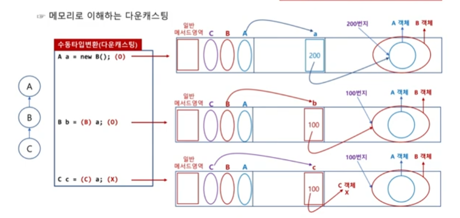

# 클래스의 상속과 다형성

## 클래스 상속의 개념과 문법적 특징

### 상속의 개념
클래스 상속은 부모 클래스의 멤버(필드, 메서드, 이너 클래스)를 내려받아 자식 클래스 내부에 포함시키는 문법 요소입니다.

> UML(unified modeling language)로 상속을 표시할 때는 화살표를 부모 클래스 쪽으로 향하게 그립니다.


### 상속의 장점
상속의 장점은 `코드의 중복성이 제거`되는 점과 `클래스의 다형적 표현이 가능`하다는 점이 있습니다.

- 사실 코드의 중복성 제거로 얻을 수 있는 장점은 그리 크지 않습니다.
실제 개발을 하다 보면 코드 중복을 해결하기 위해 상속을 하는 것보다 간단한 코드들은 각각의 클래스에 넣어 작성하는 것이 오히려 개발 속도도 빠르고 효율적일 때가 많습니다.

- 1개의 객체를 여러 가지 모양으로 표현할 수 있는 특성을 `다형성(polymorphism)`이라고 합니다.

예를 들어 사과, 포도, 키위 클래스를 만들고 각각의 객체를 만들어 배열로 관리하고자 한다면 배열은 같은 자료형만 저장할 수 있으므로 각각의 자료형을 따로 만들어 관리해야 합니다.  (여기서 과일이 추가된다면 새로운 자료형을 만들어줘야 합니다.)

```java
// 3개의 서로 다른 과일 배열 자료형
사과[] apple = {new 사과(), new 사과()};
포도[] grape = {new 포도(), new 포도()};
키위[] kiwi = {new 키위(), new 키위()};
```

하지만 사과, 포도, 키위는 모두 과일이기 때문에 과일이라는 부모 클래스를 만들어 상속시키면 `다형적 표현`을 할 수 있게 됩니다.

```java
과일 fruit1 = new 사과();   // 사과는 과일이다.
과일 fruit2 = new 포도();   // 포도는 과일이다.
과일 fruit3 = new 키위();   // 키위는 과일이다.
```

따라서 각각의 과일로 생성한 객체를 모두 과일이라 부를 수 있게 되므로 모든 객체를 과일 배열 하나로 관리할 수 있게 됩니다.

```java
// 1개의 배열 자료형으로 여러 과일 객체 저장
과일[] fruits = {new 사과(), new 사과(), new 포도(), new 포도(), new 키위(), new 키위()}
```

- 자바의 상속으로 다형적 표현을 할 수 있게 되었고, 다형적 표현의 사용으로 위와 같은 장점이 있습니다.


### 상속 문법
클래스를 상속할 때는 `extends` 키워드를 사용합니다.

```java
// 클래스 상속
class 자식 클래스 extends 부모 클래스 {
    ...
}
```

또한 부모 클래스의 멤버값은 당연히 자식 클래스에서 사용 가능합니다.

`자바는 모호성(ambiguous)이 발생하기 때문에 다중 상속이 불가능 합니다.`
예를 들어 클래스 A와 B를 상속받은 C가 있습니다.
여기서 각각 `A클래스의 필드 d = 3`과 `B클래스의 필드 d = 5`가 있다고 가정할 경우, 클래스를 상속받은 C는 d의 필드를 가지지만 어떤 값을 가져야 되는지 알 수 없기 때문입니다.

> Python의 경우 `MRO: 메소드 해결 순서(Method Resolution Order)` 매직 메서드가 있어, 다중 상속이 가능합니다.


### 상속할 때의 메모리 구조
클래스 영역에는 선언된 자료형의 클래스와 그 부모 클래스가 모두 로딩됩니다.
이 때 참조 변수는 자식 클래스 자료형으로 선언하기 때문에 자식 클래스의 객체를 가리키게 되고, JVM은 자식 클래스의 객체를 생성할 때 가장 먼저 부모 클래스의 객체를 생성하게 됩니다.
이후 자식 클래스에서 추가한 필드와 메서드가 객체에 추가됨으로써 전체 객체가 완성이 됩니다.

즉, 자식 클래스 객체의 내부에는 부모 클래스 객체가 포함되어 있으므로 자식 클래스 객체에서 부모 클래스의 멤버를 사용할 수 있는 것입니다.

### 생성자의 상속 여부
상속을 수행하면 부모 클래스의 모든 멤버를 내려받습니다.
생성자는 자식 클래스로 상속되지 않으며 자바 문법상 절대로 상속되어서는 안됩니다.

```java
class A {
    A() {
        ...
    }
    ...
}

class B extends A {
    A() {}  // 문법 오류
}
```

이전에도 언급 했듯이 클래스 내부에는 필드, 메서드, 생성자, 이너 클래스 이외에 문법은 올 수 없습니다.
위 예제 코드에서 B 클래스를 보면 우선 `A() {}`는 소괄호와 중괄호가 있기에 필드는 아닙니다.
그 다음, 생성자로 보기에는 클래스와 이름이 동일하지 않아서 제외되고 클래스나 메서드로 보자니 반환값이 없어서 제외됩니다.


## 객체의 타입 변환
기본 자료형에서도 언급했듯이 자바 프로그램은 등호(=)를 중심으로 항상 왼쪽과 오른쪽의 자료형이 일치해야 합니다.
만일 자료형이 서로 다르다면 컴파일러가 자동으로 타입을 변환해주거나 개발자가 직접 명시적으로 타입을 변환해 줘야합니다.

객체에서도 이러한 타입 변환이 일어나며 이를 각각 업캐스팅과 다운캐스팅이라고 합니다.

### 객체의 업캐스팅과 다운캐스팅
기본 자료형에서 업캐스팅은 범위가 좁은 쪽에서 넓은 쪽으로 캐스팅하는 것을 말하며, 다운캐스팅은 그 반대입니다.
객체는 자식 클래스에서 부모 클래스 쪽으로 변환되는 것이 업캐스팅이라 하고, 그 반대가 다운 캐스팅입니다.

객체는 항상 업캐스팅할 수 있으므로 명시적으로 적어 주지 않아도 컴파일러가 대신 넣어 주지만, 다운 캐스팅은 개발자가 직접 명시적으로 넣어줘야 합니다.

또한, 기본 자료형의 경우 다운 캐스팅할 때는 넓은 범위의 값이 좁은 범위로 바뀌기 때문에 오차가 발생해도 문법적으로 항상 가능했지만, 객체는 명시적으로 적어 준다고 해도 다운 캐스팅 자체가 안될 때가 있습니다.

잘못된 다운 캐스팅을 수행하면 문법적으로 오류가 발생하지 않지만, 실행 이후 실제 캐스팅 과정에서 ClassCastException이라는 예외가 발생하고 프로그램이 종료됩니다.

| 업 캐스팅   	| 학생은 사람이다. 	| 항상 O.                                      	|
|-------------	|------------------	|----------------------------------------------	|
| 다운 캐스팅 	| 사람은 학생이다. 	| 학생인 사람이라면 O 학생이 아닌 사람이라면 X 	|


```java
class A {}
class B extends A {}
class C extends B {}
```


```java
// 자동 타입 변환(업 캐스팅)
B b1 = new B();
A a1 = b1;  // (A) 컴파일러가 자동으로 추가

C c2 = new C();
B b2 = c2  // (A) 컴파일러가 자동으로 추가 
A a2 = c2  // (A) 컴파일러가 자동으로 추가
```

```java
// 수동 타입 변환(다운 캐스팅)
A a1 = new A();
B b1 = a1;  // 예외 발생

A a2 = new B();
B b2 = a2;  // (O)
C c2 = a2;  // 예외 발생
```

다소 복잡해 보이지만 캐스팅의 가능 여부는 `무슨 타입으로 선언되어 있는지가 중요하지 않으며, 어떤 생성자로 생성되었는지가 중요`합니다.

실제로 생성된 객체의 위쪽(업 캐스팅 방향)에 있는 모든 클래스 타입으로는 항상 캐스팅을 할 수 있습니다.


### 메모리로 이해하는 다운캐스팅
메모리에서의 동작만 잘 이해하면 캐스팅의 가능 여부뿐 아니라 선언된 타입에 따른 차이점까지 한 번에 파악할 수 있습니다.
이전과 동일하게 `A <- B <- C`의 상속 관계일 때, `A a = new B()`일 경우 실제 객체는 B() 생성자로 만들어 졌습니다.
앞서 상속에서 설명했듯이 자식 클래스의 생성자를 호출하면 부모 클래스의 객체를 먼저 생성한다고 했으므로 A 객체가 먼저 메모리에 만들어지고, 이후 B 객체가 만들어 집니다.



위 이미지를 보면 객체를 A 타입의 참조 변수로 가리키고 있습니다(A a).
이 때 실제 참조 변수는 힙 메모리의 B 객체 안에 있는 A 객체를 가리키게 됩니다.  이는 매우 중요합니다.
`선언된 타입이 의미하는 바는 실제 객체에서 자신이 선언된 타입의 객체를 가리키게 되는 것`입니다.

이제 B b = (B) a와 같이 A 타입의 a를 B 타입으로 캐스팅해 B 타입으로 저장하고자 합니다.  즉, a는 A 객체를 가리켰지만, (B) a는 B객체를 가리켜야 하는 것입니다.  힙 메모리에는 이미 B 객체가 있으므로 B 타입을 가리키는 것이 전혀 문제가 없습니다.

반면에 C c = (C) a와 같이 C 타입으로 캐스팅을 한다면, 참조 변수 c는 이제 C 타입을 가리켜야 하는데, 힙 메모리에는 C 타입 객체가 만들어진 적이 없기 때문에 다운캐스팅할 수 없습니다.

> 따라서 이와 같은 이유로 캐스팅의 가능 여부를 확인하기 위해 실제 어떤 생성자로 만들었는지가 중요했던 것입니다.


### 선언 타입에 따른 차이점

```java
class A {
    int m = 3;
    void abc() {
        System.out.println("A");
    }
}

class B extends A {
    int n = 4;
    void bcd() {
        System.out.println("B");
    }
}
```

위 코드를 B 타입과 A 타입으로 각각 선언했을 때의 차이를 알아보겠습니다.

```java
// B의 객체를 B 타입으로 선언했을 때
B b = new B();
System.out.println(b.m);    // O
System.out.println(b.n);    // O
b.abc();                    // O
b.bcd();                    // O
```

B() 생성자로 생성했으므로 힙 메모리에는 A 객체를 감싸고 있는 B 객체가 만들어졌기 때문에 A 클래스 필드와 B 클래스 필드, 모두를 사용할 수 있습니다.

```java
// B의 객체를 A 타입으로 선언했을 때
A a = new B();
System.out.println(a.m);    // O
System.out.println(a.n);    // X
a.abc();                    // O
a.bcd();                    // X
```

B() 생성자로 객체를 생성한 것은 동일하므로 힙 메모리에 생성되는 객체의 모양은 동일할 것입니다.
하지만, 참조 변수가 A 타입으로 선언되어 있으므로 실제로 힙 메모리에 B 객체가 있더라도 참조 변수 a는 A 객체만을 가리켜 A 클래스 필드만 사용할 수 있습니다.


### 캐스팅 가능 여부를 확인하는 instanceof 키워드
캐스팅 여부를 확인하기 위해서는 실제 객체를 어떤 생성자로 만들었는지와 클래스 사이의 상속 관계를 알아야 합니다.
하지만, 프로젝트 규모가 커지거나 다른 개발자가 만든 클래스를 사용할 때는 이런 정보를 일일이 알 수 없기 때문에, 이를 위해 자바는 캐스팅 가능 여부를 불리언 타입으로 확인할 수 있는 문법 요소를 제공하고 있습니다.

```java
// 캐스팅 가능 여부 확인
참조 변수 instanceof 타입     // true: 캐스팅 가능 / false: 캐스팅 불가능
```

여기서 instanceof 뒤의 타입은 참조 변수가 표현될 수 있는 모든 다형적 타입을 의미합니다.  예를 들어 `A <- B <- C`의 상속 구조는 아래와 같습니다.

```java
C c = new C();
System.out.println(c instanceof A);  // true
System.out.println(c instanceof B);  // true
system.out.println(c instanceof C);  // true
```

이렇게 instanceof 키워드를 사용하면 상속 관계나 객체를 만든 생성자를 직접 확인하지 않고도 캐스팅 가능 여부를 확인할 수 있습니다.
따라서 잘못된 캐스팅에 따른 실행 예외(ClassCastException)로 프로그램이 종료되는 것을 방지하고, 캐스팅 여부를 확인하고 가능할 때 수행합니다.


## 메서드 오버라이딩

### 메서드 오버라이딩의 개념과 동작

### 메서드 오버라이딩을 사용하는 이유

### 메서드오버라이딩과 메서드 오버로딩

### 메서드 오버라이딩과 접근 지정자


## 인스턴스 필드와 정적 멤버의 중복

### 인스턴스 필드의 중복

### 정적 필드의 중복

### 정적 메서드의 중복

### 인스턴스 멤버와 정적 멤버의 중복 정리


## super 키워드와 super() 메서드

### 부모의 객체를 가리키는 super 키워드

### 부모 클래스의 생성자를 호출하는 super() 메서드


## 최상위 클래스 Object

### Object 클래스의 주요 메서드
